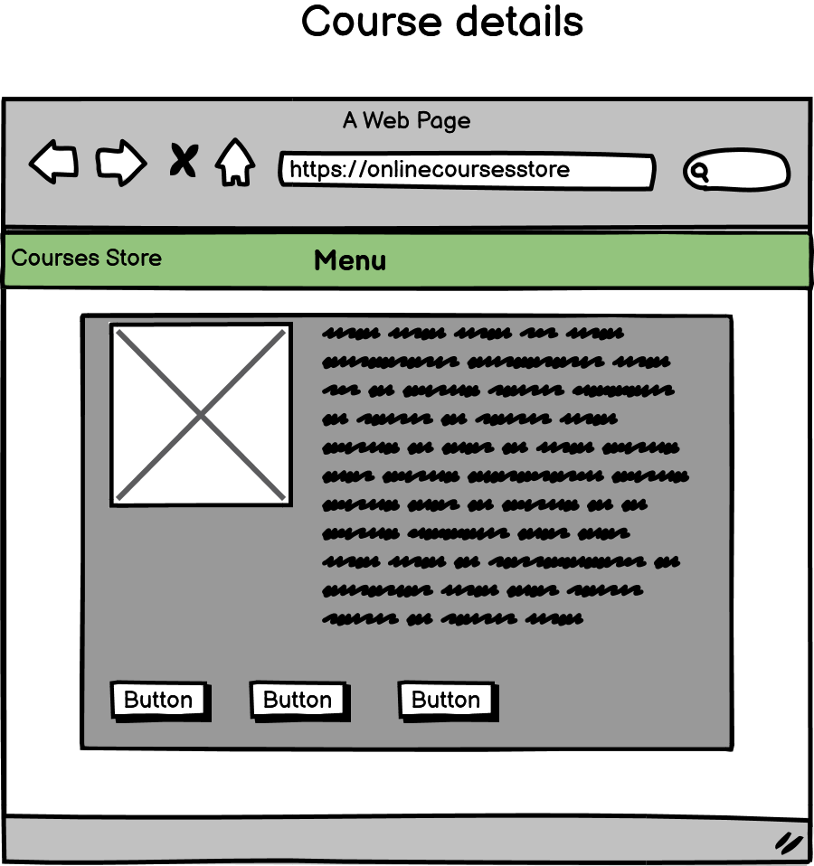
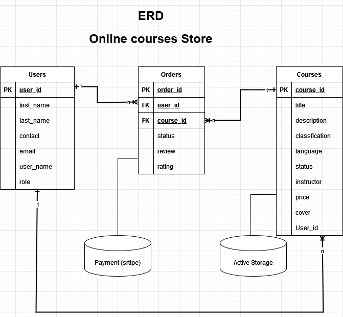

# Marketplace Project / Coder Academy Term 2 Assignment 2

# Links

**GitHub Repository:** [Click here](https://github.com/ngupange/PamphileNkurunzizaNgenzi_T2A2)

**Live Website:** [Click here](https://urugeroapp.herokuapp.com)

# Purpose

Nowadays, it is desirable for any public or private entity with an educational or formative vocation to adhere to the new formula of delivering their courses that would allow that institution to put their contents online to overcome the problems of congestion within their classes and extend their geographical scope anyone who is interested around the world can take their course.
I designed this application to help me to share my skills online and help anyone on market who want to share their skills and make a profit from it. This application will help any content creator or any school to upload online a course where anyone can buy it or stream it for free if is uploaded as a free course. This app will hold courses about different topic / subject. Different users can buy and after they will be able to review that course they bought. User can also upload a course, upgrade it, or retire it. A user who uploaded a course can see a report of all copies sold and cash out or keep it in app balance where they can use that balance to buy other courses

# Purpose:

The original intention of Online course store was to provide a marketplace in which Internet users could buy and sell skills in this growing market.

# Target Audience:

The site's primary goal is to provide a marketplace for students and educators / content creators.

# Tasks Allocation – Project Management

The tasks and features comprised of this project are broken down, implemented and tracked through the below trello board. Following an agile methodology.
Link to trello board: [Click here](https://trello.com/b/PpCH5HJm/t2a2-marketplace-project)

### Screenshots


# Entity


## Screenshots and wireframe

### 1. Wireframe view (Home page)


### screenshot view (Home page)


### 2. Wireframe view (Course's detail page)



### screenshot view (Course's detail page)


### 3. Wireframe view (Course's edit page)


### screenshot view (Course's edit page)


## Entity Relationship (ER) Diagram



## The different high-level components (abstractions)

Our application is developed using the Model View Controller structure (MVC). The MVC pattern allows us to organize source code well. The purpose of MVC is precisely to separate the logic of the code into three parts that are found in separate files.

- **Model:** This part manages our site's data. Its role is to retrieve the data in the database, organize it so that it can then be processed by the controller. It uses SQL queries to manipulate these data. For this app we have 3 Models.

  - **_Course model_** which deals with all details about courses
  - **_Order model_** which will be in charge of course’s orders. (Bought)
  - **_User model_** which deals with authentication and system roles

- **View:** This part focuses on the display. It does almost no calculation and just retrieves variables to know what it should display. There is mainly HTML code but also some loops to display for example a list of messages. For this part we generated different views to facilitate user to interact with our model. We have more than 30 pages so far and some pages we generated them using a template because they have some similarities. We also used **_client-side validation_** to sanitise data on client side before it reach in database.

- **Controller:** This part manages the logic of the code that makes decisions. It is in a way the intermediary between the model and the view: the controller will ask the model for the data, analyse it, make decisions, and return the text to be displayed to the view. The controller contains ruby code only. It determines whether the visitor has the right to see the page or not (management of access rights). Our app has 3 controllers one is generated automatically and is in charge of all application. It controls if user has right to access a certain information on view. Checks if you are logged in … second one is in charge of logic behind our courses last one deals with logic behind transactions (Buy).

### Input Validation

In order to sanitise data users filled on form we decided to do client side input validation, this approach will help us to maintain data integrity.
We must make sure that the data user filled into a field are present (not null) and are in correct format so that they can be saved properly into database and won't break our applications. And we will also help users to complete the forms correctly.
Validating form in browser (client side) will help us to fulfill these goals. When user enters data, the web application will check whether it is correct. If correct, the application will allow the data to be submitted to the server and processed / saved in a database; if not, it will issue error or warning message to explain what went wrong.

Here is the code :

```rb
    #Client side form validations sanitizing input
    validates :title, presence: true
    validates :classfication, presence: true
    validates :language, presence: true
    validates :status, presence: true
    validates :instructor, presence: true
    validates :description, presence: true
    validates :cover, presence: true
```

## R17 Describe your projects models in terms of the relationships (active record associations) they have with each other

- **A user can have zero to many orders.**

The User model has a **_One-To-Many relationship_** with the order model. Each order can only be related to one user. A user can have many orders but each has a single user.

```rb
    class User < ApplicationRecord
    # Include default devise modules. Others available are:
    # :confirmable, :lockable, :timeoutable, :trackable and :omniauthable
    devise :database_authenticatable, :registerable,
          :recoverable, :rememberable, :validatable

    # A user can have zero to many orders
    has_many :orders

    # users role and initialization for new record
    enum  role: [:user, :super_user, :admin]
    after_initialize :set_default_role, :if => :new_record?

    # Default user role

    def set_default_role
      self.role ||= :user
    end

      #Client side form validations sanitizing input
      validates :first_name, presence: true
      validates :last_name, presence: true
  end
```

- **An order belongs to one and only one user and one course.**

In our app an order has one user and one course this is different with other buy and sell models because here you only buy a course once because it's a digital copy to download, you can't say that you orderd 2 copies you will still get one.

```rb
    class Order < ApplicationRecord
      belongs_to :user
      belongs_to :course
    end
```

## User stories

- Any Guest can see all courses posted and their price
- Only Logged in User can post a new content
- Only Logged in User can edit a course
- Only Logged in User can delete a course
- Log in before you download
- A user can only see all his courses

# Database Schema Design

```rb
ActiveRecord::Schema[7.0].define(version: 2022_03_25_053642) do
  enable_extension "plpgsql"

  create_table "active_storage_attachments", force: :cascade do |t|
    t.string "name", null: false
    t.string "record_type", null: false
    t.bigint "record_id", null: false
    t.bigint "blob_id", null: false
    t.datetime "created_at", null: false
    t.index ["blob_id"], name: "index_active_storage_attachments_on_blob_id"
    t.index ["record_type", "record_id", "name", "blob_id"], name: "index_active_storage_attachments_uniqueness", unique: true
  end

  create_table "active_storage_blobs", force: :cascade do |t|
    t.string "key", null: false
    t.string "filename", null: false
    t.string "content_type"
    t.text "metadata"
    t.string "service_name", null: false
    t.bigint "byte_size", null: false
    t.string "checksum"
    t.datetime "created_at", null: false
    t.index ["key"], name: "index_active_storage_blobs_on_key", unique: true
  end

  create_table "active_storage_variant_records", force: :cascade do |t|
    t.bigint "blob_id", null: false
    t.string "variation_digest", null: false
    t.index ["blob_id", "variation_digest"], name: "index_active_storage_variant_records_uniqueness", unique: true
  end

  create_table "courses", force: :cascade do |t|
    t.string "title"
    t.string "classfication"
    t.string "language"
    t.string "status"
    t.float "price"
    t.string "instructor"
    t.text "description"
    t.datetime "created_at", null: false
    t.datetime "updated_at", null: false
  end

  create_table "orders", force: :cascade do |t|
    t.bigint "user_id", null: false
    t.bigint "course_id", null: false
    t.string "status"
    t.datetime "created_at", null: false
    t.datetime "updated_at", null: false
    t.index ["course_id"], name: "index_orders_on_course_id"
    t.index ["user_id"], name: "index_orders_on_user_id"
  end

  create_table "users", force: :cascade do |t|
    t.string "email", default: "", null: false
    t.string "encrypted_password", default: "", null: false
    t.string "reset_password_token"
    t.datetime "reset_password_sent_at"
    t.datetime "remember_created_at"
    t.string "first_name"
    t.string "last_name"
    t.string "contact"
    t.string "role", default: "0"
    t.datetime "created_at", null: false
    t.datetime "updated_at", null: false
    t.index ["email"], name: "index_users_on_email", unique: true
    t.index ["reset_password_token"], name: "index_users_on_reset_password_token", unique: true
  end

  add_foreign_key "active_storage_attachments", "active_storage_blobs", column: "blob_id"
  add_foreign_key "active_storage_variant_records", "active_storage_blobs", column: "blob_id"
  add_foreign_key "orders", "courses"
  add_foreign_key "orders", "users"
end
```

## Tech Stack

The following tech was used in the production of this portfolio:

- HTML
- SCSS
- JavaScript
- Git/Github
- Heroku (Deployment)
- AWS. (Active Storage)

## Other Resources

The following external resources were used in creating this website:

- Google Fonts
- Font awesome
- Unsplash (for stock images)
- Bootstrap 5

# Future Improvements

Due to other factors out of my control I couldn't finish what I started my plan is to finish this project before next intake. There are many things to improve and make this app fully usable.
